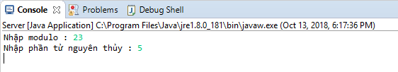
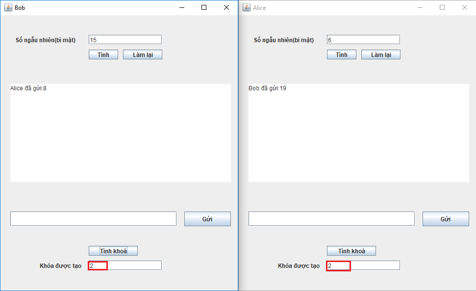

# DiffieHellmanKeyExchange
Là một phương pháp trao đổi khóa trong mật mã học. Hai bên cùng thiết lập một khóa bí mật chung, mã hóa dữ liệu và sử dụng trên kênh truyền thông không an toàn.
# Ý tưởng cơ bản
Giao thức được mô tả cơ bản như sau:
1. Alice và Bob thỏa thuận sử dụng chung một số nguyên tố p = 25 và căn nguyên thủy g = 5
2. Alice chọn một số ngẫu nhiên bí mật a = 6, gửi cho Bob giá trị A = g^a mod p = 8
3. Bob chọn một số ngẫu nhiên bí mật b = 15, gửi cho Alice giá trị B = g^b mod p = 19
4. Alice tính s = B^a mod p = 2
5. Bob tính s = A^b mod p = 2
6. Như vậy Alice và Bob đã chia sẻ khóa bí mật chung là 2 trong khi không hề truyền số này ra môi trường ngoài
# Cài đặt thuật toán bằng Java

